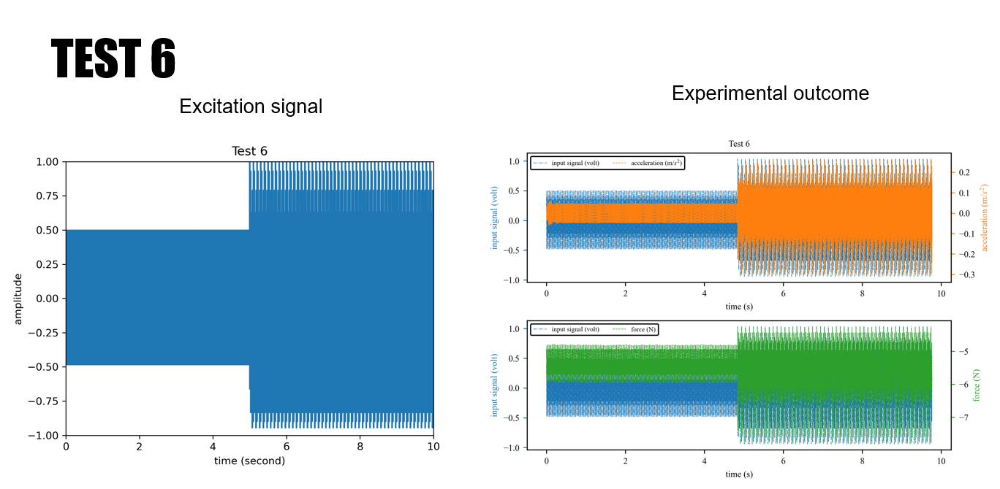

# Data

The data sets are:
* [Data I](data_I)
# Univariate-signal-with-non-stationarity
univariate signal with varying levels of non-stationarities

**TEST BENCH &amp; TRAINING DATA**

The experimental setup is shown in Figure 1. For the experiment purpose, a steel cantilever beam structure of 759x 50.66 x 5.14 mm is used and a single Integral Electronics Piezoelectric (IEPE) accelerometer (model J352C33 manufactured by PCB Piezotronics) is mounted close to the edge of the beam structure. This accelerometer has a frequency range of 0.5 Hz to 9k Hz with a sensitivity of 100 mV/g. The sensor data is digitized using a 24-bit NI-9234 IEPE signal conditioner manufactured by National Instruments. The beam is excited by an electromagnetic shaker (model V203R manufactured by LDS), with a useful frequency range of 5-13000Hz and a peak sine force of 17.8N, and is driven by a power amplifier (model PA25E-CE manufactured by LDS). A 45 N load cell (model MLP-10 manufactured by Transducer Techniques) is mounted in-between the shaker and beam structure. A 24-bit bridge input signal conditioner (NI-9237 manufactured by National Instruments) is used to acquire the load-cell data. The experiment is run through a control computer with a Virtual Instrument written in LabVIEW.

Figure 1: Experimental setup of a cantilever beam with key components and data acquisition setup.

Figure 2 (Test 3 with sampling rate 51200 Hz) reports the structure&#39;s measured acceleration response for a composite sinusoidal input from the shaker. In this work, the composite signal is made up of 100, 120, and 150 Hz sinusoidal signals. Two sine wave signals are concatenated together at _t=0_ where a 50% nonstationary is present. The first half of the composite signal is built from 100, 120, and 150 Hz frequencies while the second half signal consists of 100, 120 Hz frequencies. A 50% nonstationary event is introduced at 0 s, as measured by a 50% increase in the standard deviation of the signal. To achieve this, an input signal of 0.25 V is used before _t=0_ while a signal of 0.375 V is used after _t=0_. The entire 16-second test is shown in Figure 2 while the expanded view shows the 1 s around the nonstationary.

Figure 2: The full 16-second test is shown in the upper plot while the inset shows the 1 second around the non-stationarity.

**DATASET**

Original sampling point of the data is 51200Hz. All three tests contain undersampled versions of the data.

* Test 1: One sine wave signal built from 100, 120, and 150 Hz frequencies with no nonstationary. To achieve this, an input signal of 0.25 V is used.
* Test 2: Two sine wave signals are concatenated together at _t=0_ where a 50% nonstationary is present. The first half of the composite signal is built from 100, 120, and 150 Hz frequencies while the second half signal consists of 100, 120 Hz, and 150 frequencies. To achieve this, an input signal of 0.25 V is used before _t=0_ while a signal of 0.375 V is used after _t=0_.
* Test 3: Two sine wave signals are concatenated together at _t=0_ where a 50% nonstationary is present. The first half of the composite signal is built from 100, 120, and 150 Hz frequencies while the second half signal consists of 100 and 120 Hz frequencies. To achieve this, an input signal of 0.25 V is used before _t=0_ while a signal of 0.375 V is used after _t=0_.

<table class="tg">
<thead>
  <tr>
    <th class="tg-7btt" colspan="2">component&nbsp;&nbsp;&nbsp;list for experiment</th>
  </tr>
</thead>
<tbody>
  <tr>
    <td class="tg-uzvj" rowspan="4">hardware</td>
    <td class="tg-0pky">Integral Electronics   Piezoelectric (IEPE) accelerometer (model J352C33 manufactured by PCB   Piezotronics)</td>
  </tr>
  <tr>
    <td class="tg-0pky">electromagnetic   shaker (model V203R manufactured by LDS)</td>
  </tr>
  <tr>
    <td class="tg-0pky">power&nbsp;&nbsp;&nbsp;amplifier (model PA25E-CE manufactured by LDS)</td>
  </tr>
  <tr>
    <td class="tg-0pky">45&nbsp;&nbsp;&nbsp;N load cell (model MLP-10 manufactured by Transducer Techniques) </td>
  </tr>
  <tr>
    <td class="tg-7btt">beam&nbsp;&nbsp;&nbsp;dimensions</td>
    <td class="tg-0pky">steel cantilever beam,  759x 50.66 x 5.14 mm </td>
  </tr>
  <tr>
    <td class="tg-uzvj" rowspan="5">DAQ&nbsp;&nbsp;&nbsp;system</td>
    <td class="tg-0pky">NI-9263  4-Channel (voltage output module)</td>
  </tr>
  <tr>
    <td class="tg-0pky">NI-9239&nbsp;&nbsp;&nbsp;4-Channel (voltage input module)</td>
  </tr>
  <tr>
    <td class="tg-0pky">NI-9237&nbsp;&nbsp;&nbsp;4-Channel (loadcell as Bridge Analog Input)</td>
  </tr>
  <tr>
    <td class="tg-0pky">NI-9234&nbsp;&nbsp;&nbsp;4-Channel (vibration Input Module )</td>
  </tr>
  <tr>
    <td class="tg-0pky">cDAQ-9174&nbsp;&nbsp;&nbsp;4-Slot</td>
  </tr>
</tbody>
</table>

* [Data II](data_II)

**TEST BENCH**

The whole setup is same as Data I.

**DATASET**

Sample rate for each test: 50,000 S/s.

Each test explanation is given below:

Table: Proposed tests 

Figure 3: test 1.

Figure 4: test 2.

Figure 5: test 3.

Figure 6: test 4.

Figure 7: test 5.

Figure 8: test 6.

Figure 9: test 7.

