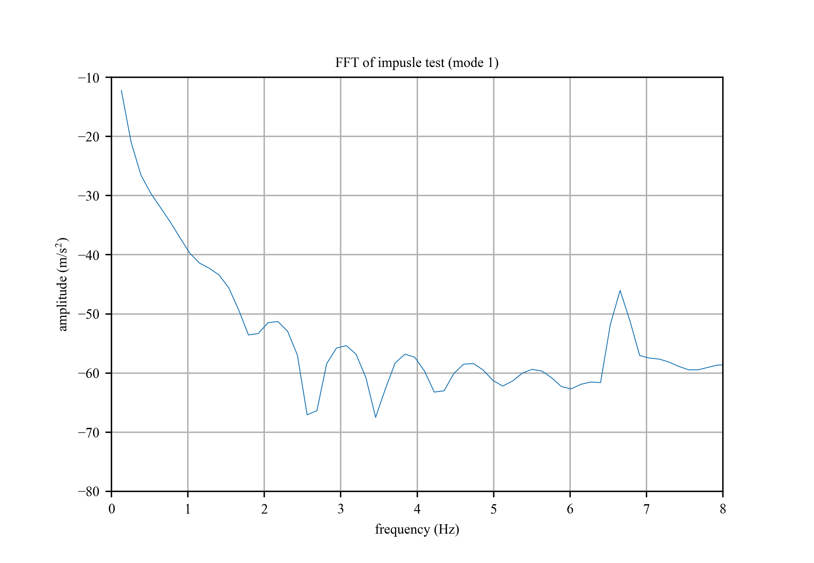
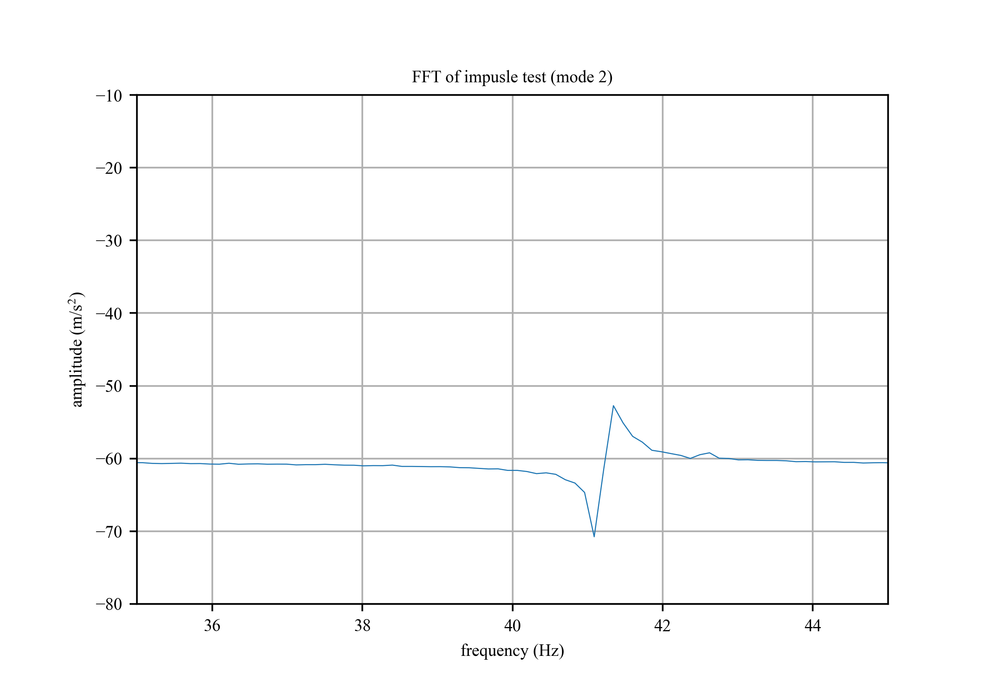
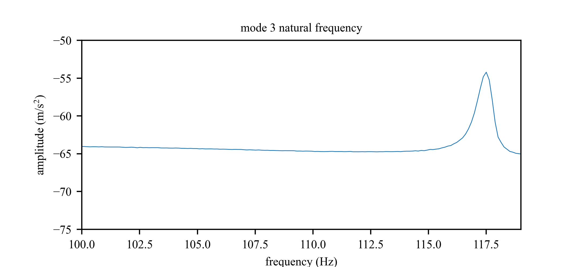

# Modal Analysis 

## Frequency Response

1. FFT data (Impulse_test.lvm)

## Mode Shapes
# Full FFT of impulse test of beam

## mode 1
# natural frequency is 6.64 Hz

## mode 2
# natural frequency is 41.34 Hz

## mode 3
# natural frequency is 117.5 Hz

