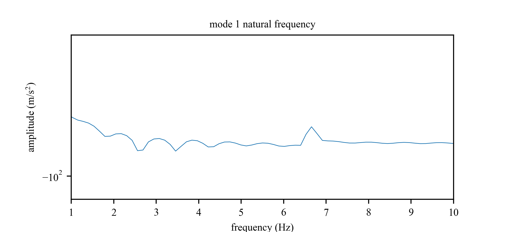
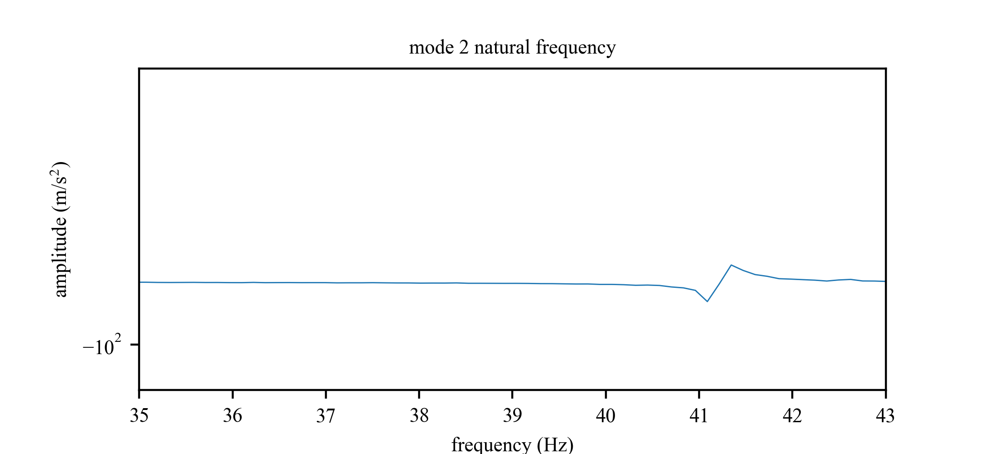
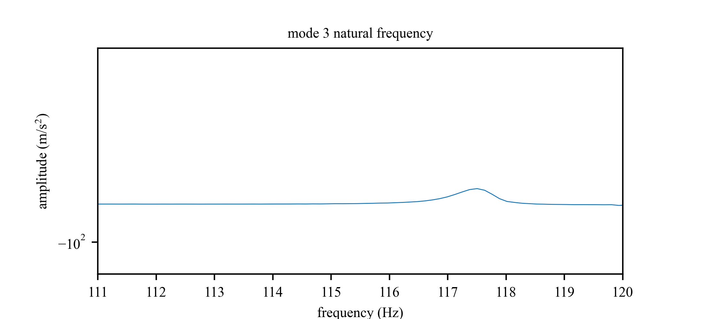

# Modal Analysis 

## Frequency Response

1. FFT data (Impulse_test.lvm)
2. labVIEW code (mode_natural_freq_check.vi)

## Mode Shapes
1. Full FFT of impulse test of beam

## mode 1
1. natural frequency is 6.64 Hz

## mode 2
1. natural frequency is 41.34 Hz

## mode 3
1. natural frequency is 117.5 Hz

