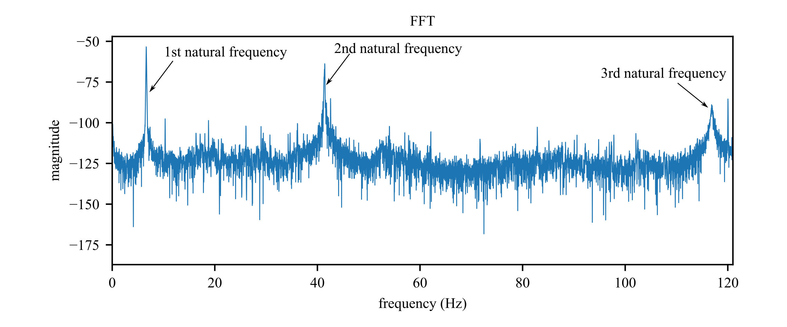

# Modal Analysis 

## Description 
1. data (FFT_data.lvm,timeseries_data.lvm)
2. labVIEW code (mode_natural_freq_check.vi)
3. python code (plot_Experiment_output.py)
4. inkscape code (naturalfreq.svg)

## Mode Shapes
1. FFT of impulse test of beam
2. mode 1: natural frequency is 6.62 Hz
3. mode 2: natural frequency is 41.4 Hz
4. mode 3: natural frequency is 117.5 Hz

## time series data

